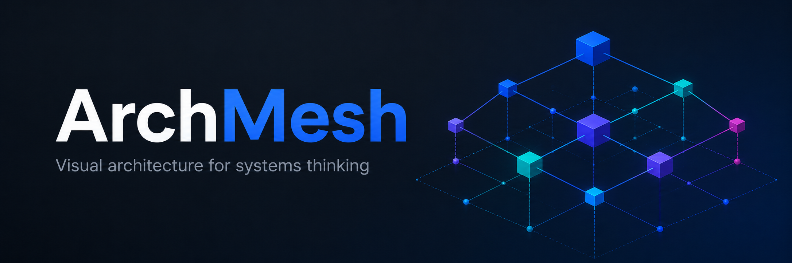

# ArchMesh

**A local-first visual architecture explorer for modern software projects.**

<p align="center">
  
</p>

> **See how your system connects. See when it doesn't.**

ArchMesh turns a real codebase into an interactive visual model of the software: products, features, routes, services, APIs, data, integrations, dependencies, changes, failures, architecture drift, and security evidence.

It is built for people who need to understand software, not just browse its files — **developers, architects, UX designers, product builders, and people building with AI coding tools.**

A useful way to think about it:

> **“I built this with AI. Now show me what I actually built.”**

That is not the only reason to use ArchMesh, but it captures the problem well: software can become complex faster than any one person can keep the whole system in their head.

## Why ArchMesh

A repository tells you where code lives. ArchMesh helps you understand what that code has become as a system.

- **Developers** can see dependencies, trace architecture, understand change impact, and investigate failures in context.
- **UX designers** can see what actually happens behind an experience — the routes, APIs, services, data, and integrations a journey depends on — without having to reconstruct the architecture from source folders.
- **AI-assisted builders** can keep up with a codebase that may be changing faster than they can manually understand it, including what an agent added, connected, changed, or potentially broke.
- **Architects and technical leads** can see system boundaries, integrations, data movement, architectural drift, and areas of risk.

ArchMesh keeps the exact scanned code graph underneath the higher-level views, so you can start with human-scale architecture and move toward implementation detail only when you need it.

## What you can see

ArchMesh provides different lenses over the same underlying system:

- **Architecture** — products, systems, features, services, routes, and implementation structure
- **Data & integrations** — where information is read, written, and sent outside the system
- **Routes & APIs** — user-facing and service-facing entry points and the relationships behind them
- **Trace & Flow** — follow directional relationships through a focused part of the architecture
- **Change impact** — see what changed in Git and what may depend on it
- **Architecture drift** — see structural changes between live scans
- **Health** — place errors and downstream impact in architectural context
- **Security** — surface evidence about sensitive data, boundaries, transport, and unknown controls
- **Code structure** — inspect the file-level graph when deeper technical detail is useful

The viewer is an interactive Three.js/WebGL 3D environment with orbit, zoom, pan, search, inspection, progressive drill-down, and editor integration.

## Local-first and evidence-backed

ArchMesh runs against a project on your machine. The core experience does **not** require an ArchMesh cloud service, hosted graph database, account, LLM, or source-code upload.

The scanner is deliberately evidence-oriented. ArchMesh distinguishes what it can detect from source, what has been configured by the project, what is inferred, and what remains unknown. It prefers an omitted relationship over a convincing fabricated one.

That matters whether you are reviewing architecture, trying to understand an AI-generated change, following a UX flow into the backend, or investigating a failure.

## Run ArchMesh locally

ArchMesh is currently pre-1.0. The supported public path is a source checkout while the first registry release is prepared.

**Requirements:** Node.js **22.18+**, npm, and a modern browser with WebGL support.

```bash
git clone https://github.com/Tranz007/ArchMesh.git
cd ArchMesh
npm install
npm run atlas -- /absolute/path/to/your/project
```

Keep the architecture live while the project changes:

```bash
npm run atlas -- /absolute/path/to/your/project --watch
```

ArchMesh scans the target project, starts the local viewer, and opens it in your browser. Watch mode rebuilds the graph as the code changes, which makes it especially useful beside an IDE or AI coding tool.

See **[Getting Started](docs/GETTING_STARTED.md)** for guided mode, CLI options, Git change analysis, diagnostics, editor integration, and other launch modes.

## Supported codebases

ArchMesh uses a layered **language-plugin + framework-adapter + shared graph** architecture.

**Deep framework support today:** Next.js App Router, Angular, and FastAPI.

**Structural support:** JavaScript/TypeScript, Python, React, Node.js, common workspace layouts, and several related frameworks where ArchMesh can already build a useful source/dependency graph even when framework-specific semantics are not yet complete.

Additional frameworks and languages are planned. See the **[Codebase Support Matrix](docs/SUPPORT_MATRIX.md)** for exact coverage and limitations, or **[Plugin Development](docs/PLUGIN_DEVELOPMENT.md)** if you want to extend ArchMesh.

## How it works

```text
Your codebase
     │
     ▼
Language scanners
     │
     ▼
Framework adapters
     │
     ▼
Shared architecture graph
     │
     ├── architecture + topology
     ├── change impact + drift
     ├── health
     └── security evidence
     │
     ▼
Interactive 3D visualization
```

The visualization is a projection of the underlying graph evidence rather than a separately maintained architecture diagram.

See **[Architecture](docs/ARCHITECTURE.md)** and **[Graph Model](docs/GRAPH_MODEL.md)** for the technical model.

## Documentation

Start with the **[Documentation Guide](docs/README.md)**, or jump directly to:

- [Getting Started](docs/GETTING_STARTED.md)
- [Architecture](docs/ARCHITECTURE.md)
- [Codebase Support Matrix](docs/SUPPORT_MATRIX.md)
- [Configuration](docs/CONFIGURATION.md)
- [Security Lens](docs/SECURITY_LENS.md)
- [Health and Observability](docs/HEALTH_AND_OBSERVABILITY.md)
- [Development](docs/DEVELOPMENT.md)
- [Roadmap](docs/ROADMAP.md)

## Project status

ArchMesh is pre-1.0. The project has an explicit release finish line rather than treating a visually impressive graph as “done.”

See the **[Roadmap](docs/ROADMAP.md)** and **[Definition of Done](docs/DEFINITION_OF_DONE.md)** for current release gates and quality criteria.

## Contributing

Contributions are welcome. Please read [CONTRIBUTING.md](CONTRIBUTING.md), [AGENTS.md](AGENTS.md), and [Plugin Development](docs/PLUGIN_DEVELOPMENT.md) before extending scanner support.

## License

MIT © Tony Moura
